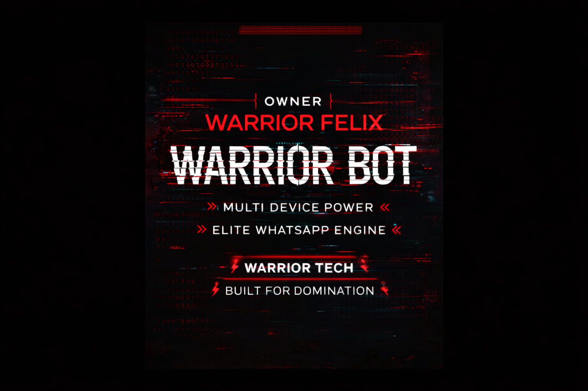

<div align="center">




**The Ultimate Multi-Device WhatsApp Bot**

[](https://github.com/Fellix-234/Warrior-Bot/stargazers)
[](https://github.com/Fellix-234/Warrior-Bot/network/members)
[](https://github.com/Fellix-234)
[](https://github.com/Fellix-234/Warrior-Bot)


### 🎮 QUICK LINKS

<p align="center">
  <a href="https://github.com/Fellix-234/Warrior-Bot/fork">
    
  </a>
  <a href="https://warrior-bot-2.onrender.com/">
    
  </a>
  <a href="https://wa.me/2547391914">
    
  </a>
</p>


### 📖 ABOUT
**Warrior Bot** is a high-performance, modular WhatsApp assistant built on the latest `@whiskeysockets/baileys` library. Designed for efficiency and visual excellence, it brings a suite of powerful commands directly to your fingertips.


### 📊 GITHUB STATS

<p align="center">
  
  <br>
  
</p>


### 🚀 DEPLOYMENT

#### ☁️ 1-Click Deploy
| Platform | Button |
| :--- | :--- |
| **Render** | [](https://render.com/deploy?repo=https://github.com/Fellix-234/Warrior-Bot) |
| **Railway** | [](https://railway.app/template/deploy?repo=https://github.com/Fellix-234/Warrior-Bot) |

#### 🖥️ VPS / Panel Deployment
```bash
git clone https://github.com/Fellix-234/Warrior-Bot.git
cd WARRIOR-BOT
npm install
node index.js
```

#### 🌐 Accessing the Web UI
After starting the bot, open your browser:
- **Local:** `http://localhost:3000`
- **VPS/Server:** `http://YOUR_SERVER_IP:3000`
- **Cloud (Render/Railway):** Use the provided deployment URL

The web UI allows you to:
- Generate pairing codes
- Scan QR codes
- Check connection status
- Reset session

#### 🔗 Auto-Pairing Mode (For Cloud Deployment)
If deploying to cloud platforms where you can't scan QR codes:
1. Set `PAIRING_NUMBER` in your `.env` file (e.g., `PAIRING_NUMBER=254712345678`)
2. Start the bot - it will display a pairing code in the logs
3. Open WhatsApp → Linked Devices → Link a Device → Link with Phone Number
4. Enter the code from the logs


### ✨ FEATURES

- 🔴 **Modular Plugin System**: Add/Remove features instantly.
- 🟠 **Auto-Automation**: Status viewing, reactions, and more.
- 🟡 **Media Downloader**: High-quality YouTube audio and video.
- 🟢 **Interactive Games**: TTT, RPS, and fun group challenges.
- 🔵 **Owner Protection**: Secure evaluation and broadcast tools.
- 🟣 **Privacy Controls**: Command-level access restrictions for owners and groups.
- 🔴 **Video Note Support**: Professional video notes for alive command (optional).


### 🔐 PRIVACY & ACCESS CONTROL

Warrior Bot includes built-in privacy controls:

- **Owner Commands** 🔑: Restricted to the bot owner only (eval, broadcast)
- **Group Commands** 👥: Only work in group chats (kick, promote, tagall, etc.)
- **Smart Menu**: Automatically hides restricted commands from unauthorized users

Set your owner number in `.env`:
```env
OWNER_NUMBER=254712345678
```


### 🎬 VIDEO NOTE FEATURE

Enable professional video notes for the `.alive` command:

1. Add a video file to `./assets/alive_note.mp4` (or use a URL)
2. Configure in `.env`:
```env
ENABLE_VIDEO_NOTE=true
VIDEO_NOTE_URL=./assets/alive_note.mp4
```

When enabled, `.alive` sends a circular video note (like Instagram stories) instead of a static image.


### 👥 DEVELOPERS

<div align="center">
  <table style="width:100%; border:none; border-collapse:collapse;">
    <tr>
      <td align="center" style="border:none;">
        
        <br>
        <b>Warrior Felix</b>
        <br>
        <a href="https://wa.me/2547391914">
          
        </a>
      </td>
      <td align="center" style="border:none;">
        
        <br>
        <b>Wondering Jew</b>
        <br>
        <a href="https://wa.me/254701881604">
          
        </a>
      </td>
    </tr>
  </table>
</div>


</div>
